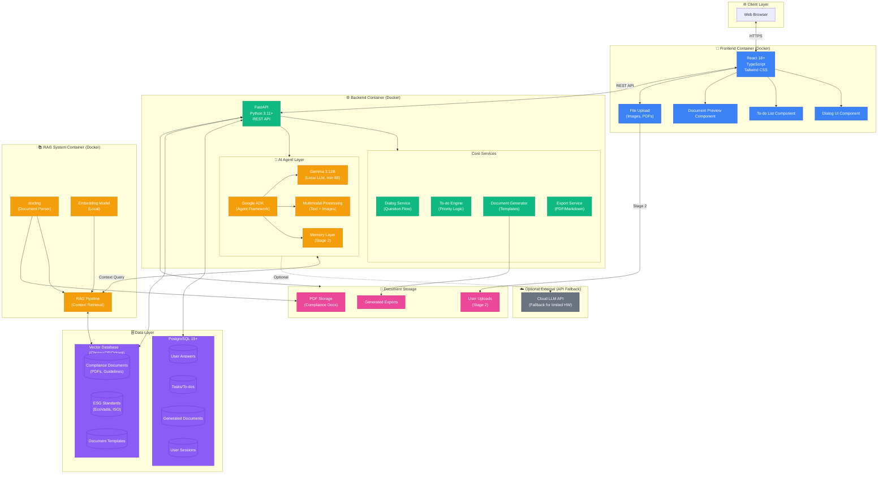
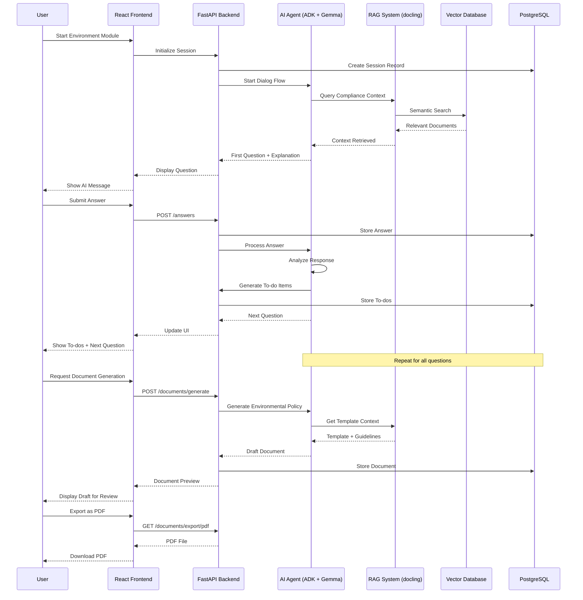
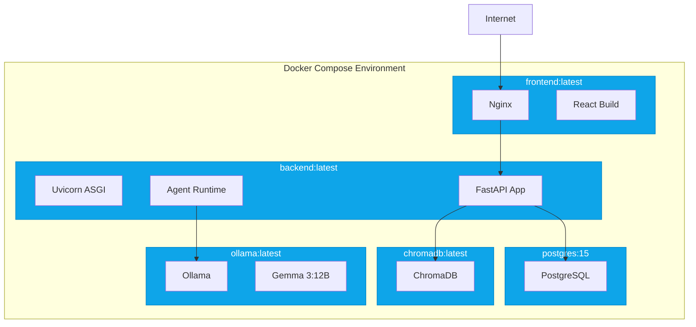

# ImpactPath / ESG-Hub - Technical Architecture

## System Architecture Diagram

## Component Details

### Frontend (React)
- **Technology**: React 18+ with TypeScript
- **Styling**: Tailwind CSS / CSS Modules
- **Key Components**:
  - Dialog Chat Interface
  - To-do List Management
  - Document Preview & Export
  - Multimodal File Upload (Images, PDFs)

### Backend (FastAPI)
- **Technology**: Python 3.11+ with FastAPI
- **API**: RESTful endpoints
- **Core Services**:
  - **Dialog Service**: Manages question flow and user interactions
  - **To-do Engine**: Generates prioritized action items
  - **Document Generator**: Creates templates (Environmental Policy, etc.)
  - **Export Service**: PDF/Markdown generation

### AI Agent Layer
- **Google ADK**: Agent orchestration framework
- **Gemma 3:12B**: Local LLM (minimum 8B for limited hardware)
- **Multimodal**: Text and image processing capabilities
- **Memory Layer** (Stage 2): Persistent context across sessions

### RAG System
- **docling**: PDF and document parsing
- **Embeddings**: Local embedding model for semantic search
- **Pipeline**: Context retrieval from compliance documents

### Databases
- **PostgreSQL**: Structured data (answers, tasks, documents, sessions)
- **Vector DB (ChromaDB/Qdrant)**: Embeddings for RAG system
  - Compliance documents
  - ESG standards and guidelines
  - Document templates

### Infrastructure
- **Docker**: Containerized deployment
- **Self-Hosting**: Full data sovereignty
- **Optional Cloud Fallback**: API-based LLM for limited hardware

---

## Data Flow Diagram

---

## Module Architecture

```mermaid
flowchart LR
    subgraph Stage1["Stage 1 - Environment Module"]
        ENV_Q["Question Catalog<br/>(Climate, Energy, Resources)"]
        ENV_T["To-do Templates"]
        ENV_D["Environmental Policy<br/>Document Templates"]
    end

    subgraph Stage2["Stage 2 - Extensions"]
        SOC_Q["Social Module<br/>(Labor & Human Rights)"]
        SOC_T["Social To-do Templates"]
        SOC_D["Social Policy Templates"]

        MEM["Memory Enhancement"]
        DOC_PROC["User Document<br/>Processing (PDFs, Scans)"]
    end

    subgraph Future["Future - Governance"]
        GOV_Q["Governance Module"]
        GOV_T["Governance Templates"]
        GOV_D["Governance Documents"]
    end

    Stage1 --> Stage2
    Stage2 --> Future

    classDef s1 fill:#10B981,stroke:#059669,color:white
    classDef s2 fill:#3B82F6,stroke:#1D4ED8,color:white
    classDef future fill:#8B5CF6,stroke:#6D28D9,color:white

    class ENV_Q,ENV_T,ENV_D s1
    class SOC_Q,SOC_T,SOC_D,MEM,DOC_PROC s2
    class GOV_Q,GOV_T,GOV_D future
```

---

## Technology Stack Summary

| Layer | Technology | Purpose |
|-------|------------|---------|
| **Frontend** | React 18+, TypeScript, Tailwind CSS | Modern responsive UI |
| **Backend** | Python 3.11+, FastAPI | REST API, Business Logic |
| **Database** | PostgreSQL 15+ | Structured data storage |
| **Vector DB** | ChromaDB / Qdrant | RAG embeddings storage |
| **AI Agent** | Google ADK | Agent orchestration |
| **LLM** | Gemma 3:12B (local) | Dialog generation, explanations |
| **RAG** | docling | Document parsing & retrieval |
| **Container** | Docker, Docker Compose | Deployment & isolation |
| **Export** | WeasyPrint / Pandoc | PDF/Markdown generation |

---

## Deployment Architecture

